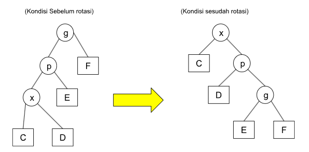
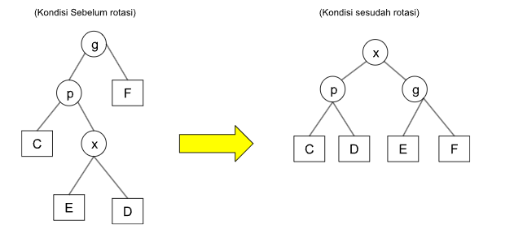
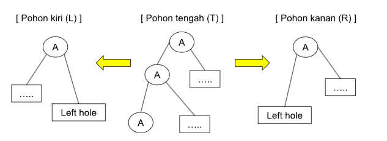
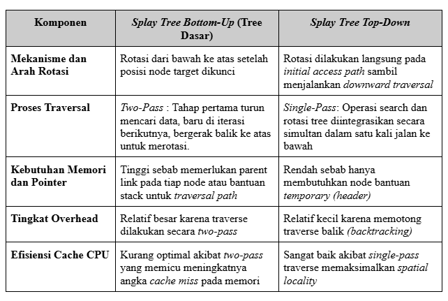
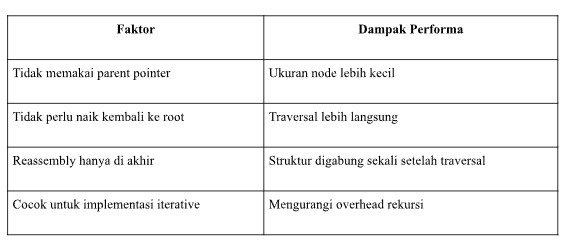
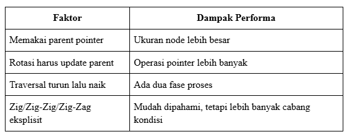

# LAPORAN AKHIR TUGAS 3

## STRUKTUR DATA DAN PEMROGRAMAN BERORIENTASI OBJEK

### MENGANALISIS TOP-DOWN SPLAY TREE

**Disusun Oleh :** 

| Nama | NRP |
| --- | --- |
| Farrel Arteya Kumara | 5027251020 |
| Daffa Rifqi As Shidiq | 5027251038 |
| Aliya Rahmadina | 5027251056 |
| Reyhan Adi Satrio | 5027251080 |
| D'qhaizhar Ari Dhiaulhaq | 5027251083 |


**Dosen Pengampu Matakuliah:** Hafara Firdausi 

**JURUSAN TEKNOLOGI INFORMASI** 

**INSTITUT TEKNOLOGI SEPULUH NOPEMBER** 

**SURABAYA** 

**2026** 

---

## BAB I: PENDAHULUAN 

### 1. Latar Belakang 

Sleator dan Tarjan (1985) membuktikan bahwa Splay Tree memiliki kemampuan unik untuk merestrukturisasi dirinya sendiri secara mandiri. Melalui mekanisme ini, node mana pun yang diakses dapat ditarik menuju posisi root (akar) dalam estimasi waktu logaritmik yang diamortisasi. Dalam penelitian tersebut, mereka menawarkan dua variasi pendekatan, yaitu Bottom-Up dan Top-Down. Pada tahun yang sama, Subramanian memperluas konsep Bottom-Up Splay Tree rancangan Sleator dan Tarjan ke dalam bentuk yang lebih umum. Ia mendefinisikan struktur ini sebagai sekumpulan aturan yang bekerja berdasarkan pasangan template dan result.

Sleator dan Tarjan membuktikan bahwa varian Bottom-Up Splay Tree membutuhkan waktu *amortized* logaritmik. Namun, hal itu tidak dibuktikan melalui Top-Down Splay Tree. Setahun kemudian, Mäkinen menerbitkan bukti bahwa prosedur TD memang berjalan dalam waktu *amortized* logaritmik.

Pada varian Bottom-Up Splay Tree, penyesuaian struktur pohon dilakukan otomatis lewat operasi *splaying*. Operasi ini mengeksekusi serangkaian rotasi terstruktur yang bergerak merambat dari posisi bawah (lokasi simpul target ditemukan) naik ke atas hingga mencapai akar pohon. Melalui proses *splaying* tersebut, pohon tidak dituntut untuk selalu berada dalam kondisi seimbang secara kaku. Strukturnya justru menyesuaikan diri dengan riwayat data yang paling akhir atau paling sering diakses. Karakteristik adaptif ini membuat Bottom-Up Splay Tree sangat andal ketika menangani pola data yang memiliki kecenderungan lokalitas tertentu (*locality of reference*), karena node-node "populer" otomatis terkumpul di area atas pohon.

Kelebihan ini membuat Splay Tree banyak diimplementasikan pada arsitektur komputasi yang membutuhkan respons cepat, seperti manajemen cache, alokasi memori, algoritma routing jaringan, sistem berkas (*file system*), hingga basis data skala besar. Berbeda dengan AVL Tree yang bergantung pada komponen *balance factor* atau Red-Black Tree yang rumit dengan pewarnaan simpulnya, Splay Tree mampu mendongkrak efisiensi akses data tanpa membebani memori dengan metadata tambahan untuk menjaga keseimbangan.

Meski begitu, kelemahan mendasar dari model Bottom-Up terletak pada pemisahan tahap kerja. Algoritma harus menyelesaikan penelusuran (*traversal*) ke bawah terlebih dahulu sebelum bisa memulai proses rotasi kembali ke atas. Kendala efisiensi akibat proses dua arah inilah yang memicu lahirnya metode Top-Down Splaying, yang mampu memotong jalur dengan menyatukan pencarian dan rotasi dalam satu fase perjalanan turun. Oleh karena itu, membedah karakteristik dasar dari Bottom-Up Splay Tree menjadi krusial sebelum menganalisis pengembangan metode yang lebih efisien.

#### 2. Permasalahan 

Dalam ranah ilmu komputer, tingkat efisiensi operasi pencarian, penyisipan, dan penghapusan pada struktur data tree sangat ditentukan oleh faktor keseimbangan struktur tree itu sendiri. Pada Binary Search Tree (BST), sangat rentan terhadap urutan data yang masuk. Jika data diinput secara berurutan atau terurut, pohon akan tidak seimbang dan bentuknya berubah menyerupai linked list. Yang menyebabkan, batas atas kompleksitas waktu operasi dasar yang idealnya bernilai $O(\log n)$ akan merosot drastis menjadi $O(n)$ pada skenario terburuk (*worst-case*). Solusi seperti AVL Tree dan Red-Black Tree bisa mengatasi masalah ini, tetapi keduanya menuntut aturan *rebalancing* serta informasi tambahan untuk menjaga keseimbangan tree.

Sebagai alternatif, Sleator dan Tarjan memperkenalkan Splay Tree. Struktur ini beroperasi sebagai *self-adjusting binary search tree* yang mampu merestrukturisasi bentuknya secara mandiri berdasarkan pola akses data pengguna. Dengan memanfaatkan data yang baru saja atau sering diakses punya peluang besar untuk dipanggil kembali, Splay Tree akan langsung menarik node target menuju posisi root lewat operasi *splaying*. Melalui mekanisme ini, memungkinkan Splay Tree mempunyai *amortized complexity* sebesar $O(\log n)$ tanpa perlu dibebani atribut keseimbangan tambahan di setiap node.

Meski begitu, Bottom-Up Splay Tree memiliki kelemahan pada efisiensi langkah kerjanya. Proses penataan ulang pohon baru bisa dieksekusi setelah penelusuran data selesai dilakukan. Artinya, algoritma harus berjalan turun dulu ke bawah untuk mengunci posisi node target, baru kemudian bergerak balik ke atas menuju akar sembari melakukan rotasi berpasangan. Sifat penelusuran dua arah (*two-pass*) ini memaksa kode program untuk memerlukan mekanisme tambahan, baik berupa *parent pointer* pada tiap node maupun alokasi *stack* di memori untuk melacak jalur *traversal* yang sudah dilewati. Melalui pendekatan ini, membuat Bottom-Up Splaying kurang optimal secara waktu dan cenderung rumit saat diimplementasikan.

Dari keterbatasan inilah lahir variasi Top-Down Splay Tree. Pendekatan modifikasi ini memangkas proses pencarian dengan mengintegrasikan fase pencarian dan rotasi sekaligus dalam satu kali jalan dari atas ke bawah (*single-pass*). Sepanjang proses bergerak turun, pohon utama langsung dipecah menjadi sub-pohon kiri dan kanan secara dinamik, lalu dirakit kembali di sekitar node target. Dengan menghilangkan kebutuhan untuk menelusuri balik jalur memori, pendekatan Top-Down menawarkan arsitektur kode yang jauh lebih ringkas tanpa mengurangi karakteristik efisiensi bawaan Splay Tree.

### 3. Tujuan 

Berdasarkan rumusan masalah dan konteks penelitian struktur data yang dihadapi, tujuan dari pelaksanaan tugas dan penyusunan laporan akhir ini adalah: 

1. Mengimplementasikan variasi struktur data Tree berbasis paper ilmiah terbitan 10 tahun terakhir untuk memenuhi standar kompetensi praktis mata kuliah Struktur Data dan Pemrograman Berorientasi Objek.


2. Memetakan karakteristik komponen serta perubahan struktur pada Top-Down Splay Tree saat melakukan operasi pembongkaran pohon menjadi sub-pohon L, R, dan T.


3. Mengembangkan kode program operasi pencarian (*search*), penyisipan (*insert*), dan penghapusan (*delete*) menggunakan metode satu fase (*single-pass operation*) tanpa ketergantungan pada *parent pointer* atau *stack* pembantu.


4. Mengevaluasi efisiensi algoritma melalui komparasi teoritis dengan Splay Tree dasar (Bottom-Up) serta pengujian performa nyata (*real performance*) berbasis parameter waktu eksekusi dan konsumsi memori.


---

## BAB II: LANDASAN TEORI 

### 2.1 Karakteristik dan Komponen Struktur Splay Tree 

Secara struktural, Splay Tree adalah jenis pohon pencarian biner (*Binary Search Tree* / BST) di mana setiap simpul (*node*) mematuhi properti BST standar: nilai pada semua simpul di sub-pohon kiri selalu lebih kecil dari simpul induk, dan nilai pada semua simpul di sub-pohon kanan selalu lebih besar dari simpul induk. Komponen pembentuk struktur ini meliputi: 

1. **Simpul (Node):** Setiap objek data dalam pohon yang menyimpan komponen kunci (*key/value*), serta penunjuk objek (*pointer*) ke anak kiri (*left child*) dan anak kanan (*right child*).


2. **Akar (Root):** Simpul teratas yang menjadi gerbang utama dalam setiap operasi penelusuran.


3. **Daun (Leaf):** Simpul-simpul terminal pada bagian bawah pohon yang tidak memiliki anak (penunjuk kiri dan kanannya bernilai `NULL`).


Perbedaan utama antara Splay Tree dengan BST biasa terletak pada ketiadaan parameter keseimbangan statis. Struktur ini tidak menyimpan data tinggi (*height*) seperti pada AVL Tree, atau data warna (*color bit*) seperti pada Red-Black Tree. Keseimbangan pohon dijaga secara dinamis melalui operasi Splay—sebuah mekanisme restrukturisasi berkala yang memindahkan simpul yang baru diakses ke posisi root.

### 2.2 Perubahan Struktur: Bottom-Up vs. Top-Down Splay Tree 

Dalam penerapannya, terdapat perbedaan mendasar pada bagaimana struktur komponen pohon ini berubah selama operasi pembongkaran dan penataan ulang: 

#### 2.2.1 Struktur Bottom-Up Splay Tree (Standard) 

Untuk memindahkan simpul target menuju posisi root, algoritma harus menelusuri pohon ke bawah hingga menemukan simpul tersebut, baru kemudian melakukan rotasi berantai ke atas (*bottom-up*). Akibatnya, setiap node dalam struktur ini wajib menyimpan satu komponen pointer tambahan, yaitu penunjuk ke induknya sendiri (*parent pointer*). Jika tidak menggunakan *parent pointer*, algoritma memerlukan struktur data bantuan berupa *stack* untuk merekam jalur penelusuran secara urut terbalik. Hal ini meningkatkan beban penggunaan memori laporan.

#### 2.2.2 Struktur Top-Down Splay Tree (Modifikasi) 

Modifikasi *top-down* memotong jalur penelusuran ganda tersebut. Struktur pohon dibongkar dan ditata ulang secara langsung saat algoritma berjalan ke bawah mencari simpul target. Selama proses pencarian ke bawah, struktur Splay Tree utama dipecah secara dinamis menjadi tiga sub-pohon biner sementara: 

1. **Pohon Kiri (L):** Menyimpan simpul-simpul yang nilainya dipastikan lebih kecil dari sub-pohon yang sedang diperiksa.


2. **Pohon Kanan (R):** Menyimpan simpul-simpul yang nilainya dipastikan lebih besar dari sub-pohon yang sedang diperiksa.


3. **Pohon Tengah (T):** Sisa sub-pohon asli yang masih mengandung simpul target dan terus ditelusuri ke bawah.


Dengan membagi struktur menjadi tiga komponen sementara ini, Top-Down Splay Tree berhasil menghilangkan kebutuhan akan *parent pointer* ataupun *stack* eksternal. Begitu simpul target ditemukan di ujung penelusuran, pohon L, R, dan simpul target pada pohon T dirakit kembali (*reassembled*) menjadi satu struktur pohon biner tunggal yang utuh dengan simpul target berada di posisi root.

### 2.3 Algoritma Operasional 

Algoritma operasional pada Top-Down Splay Tree mengintegrasikan fase pencarian jalur (*traversal*) dan fase penataan ulang pohon (*splaying*) ke dalam satu tahapan terpadu dari atas ke bawah (*single-pass operation*). Berbasis pada tiga komponen penampung utama yakni Pohon Kiri (L), Pohon Kanan (R), dan Pohon Tengah (T). Berikut adalah deskripsi langkah-langkah logika prosedural untuk tiga operasi dasar: 

#### 2.3.1 Operasi Pencarian (Search) 

Operasi pencarian diawali dengan memposisikan akar pohon asli sebagai hulu dari Pohon Tengah (T), sedangkan Pohon Kiri (L) dan Pohon Kanan (R) diinisialisasi dalam kondisi kosong. Algoritma kemudian melakukan evaluasi terhadap kunci simpul akar saat ini di Pohon Tengah (T) secara berulang.

* Jika kunci target lebih kecil dari kunci akar T, algoritma akan memeriksa anak kiri dari akar tersebut. Apabila kunci target juga lebih kecil dari kunci anak kirinya (**kondisi Zig-Zig**), dilakukan rotasi kanan pada simpul akar pohon T untuk memperkecil tinggi pohon sebelum simpul induk dipotong. Setelah itu, simpul induk beserta sub-pohon kanannya diputus dari pohon T dan disambungkan ke posisi *Right Hole* pada Pohon Kanan (R).


* Sebaliknya, jika kunci target lebih besar dari kunci akar T, algoritma akan memeriksa anak kanan dari akar tersebut. Jika kondisi memenuhi kriteria rotasi left-left (**kondisi Zag-Zag**), dilakukan rotasi kiri pada simpul akar pohon T, kemudian simpul induk beserta sub-pohon kirinya diputus untuk disambungkan ke posisi *Left Hole* pada Pohon Kiri (L).


Proses ini terus berjalan ke bawah hingga simpul dengan kunci target ditemukan atau algoritma mencapai simpul daun terakhir (pencarian gagal). Sebagai tahap akhir, operasi perakitan kembali (*reassembly*) dijalankan secara otomatis dengan menyambungkan seluruh sub-pohon yang ada di penampung L menjadi anak kiri dari simpul target, dan seluruh sub-pohon di penampung R menjadi anak kanan dari simpul target. Simpul target kini berada di posisi akar utama (*root*) pohon yang baru.

#### 2.3.2 Operasi Penyisipan (Insertion) 

Operasi penyisipan data baru dilakukan dengan memanfaatkan fungsi pembantu pencarian (*splay*) terlebih dahulu terhadap kunci data yang akan dimasukkan. Langkah proseduralnya: 

1. Fungsi *splay* dipanggil menggunakan kunci data baru yang akan disisipkan.


2. Jika kunci tersebut ternyata sudah ada di dalam pohon, operasi dihentikan atau mengembalikan pesan galat (*error*) untuk mencegah duplikasi data.


3. Jika kunci tidak ditemukan, fungsi *splay* akan membawa simpul terakhir yang diakses (baik itu *inorder predecessor* maupun *inorder successor* dari kunci baru) naik menjadi akar utama (*root*) pohon saat ini.


4. Sebuah simpul baru dialokasikan ke dalam memori untuk menampung kunci data baru tersebut, dan simpul ini langsung diposisikan sebagai akar utama yang baru bagi keseluruhan pohon.


5. Struktur pohon disesuaikan berdasarkan nilai akar lama yang dihasilkan oleh proses *splay* sebelumnya: 


* Jika nilai akar lama lebih kecil dari kunci baru, maka akar lama beserta sub-pohon kirinya dipasangkan menjadi anak kiri dari simpul baru, sementara sub-pohon kanan dari akar lama dipasangkan menjadi anak kanan dari simpul baru.


* Jika nilai akar lama lebih besar dari kunci baru, kondisi disesuaikan secara simetris di mana akar lama beserta sub-pohon kanannya menjadi anak kanan dari simpul baru.


Melalui mekanisme ini, elemen baru yang baru saja disisipkan otomatis berada di posisi teratas pohon, mematuhi prinsip lokalitas referensi.

#### 2.3.3 Operasi Penghapusan (Deletion) 

Operasi penghapusan simpul dilakukan dengan cara membawa simpul target yang ingin dihapus menuju posisi akar utama terlebih dahulu melalui fungsi *splay*. Prosedur eksekusinya: 

1. Fungsi *splay* dijalankan untuk mencari kunci simpul yang akan dihapus. Jika kunci tidak ditemukan, operasi langsung selesai tanpa mengubah struktur.


2. Jika simpul target ditemukan, proses *splay* otomatis menempatkan simpul tersebut di posisi akar utama, menyisakan sub-pohon anak kiri (L) dan sub-pohon anak kanan (R) di bawahnya.


3. Jika salah satu sub-pohon anak (baik kiri atau kanan) bernilai `NULL`, simpul target dapat langsung dihapus dari memori, dan sub-pohon anak yang tidak kosong langsung diangkat menjadi akar utama pohon yang baru.


4. Jika kedua sub-pohon anak kiri (L) dan kanan (R) tidak kosong, algoritma melakukan isolasi dengan memutus hubungan simpul target dari kedua anak pohon tersebut.


5. Fungsi *splay* kemudian dipanggil kembali, tetapi ruang lingkupnya dibatasi khusus di dalam sub-pohon anak kiri (L) untuk mencari elemen dengan nilai terbesar (*inorder predecessor* dari simpul target).


6. Karena simpul yang dicari adalah elemen terbesar di sub-pohon kiri, simpul tersebut dipastikan tidak memiliki anak kanan lagi setelah berhasil naik menjadi akar baru bagi sub-pohon kiri (L).


7. Jalur kosong pada anak kanan dari akar sub-pohon kiri yang baru tersebut kemudian langsung disambungkan kembali ke sub-pohon anak kanan (R) yang sebelumnya diisolasi.


Simpul target asli kini telah terhapus sepenuhnya dari memori laporan tanpa merusak integritas struktur pohon biner.

---

## BAB III: VISUALISASI TOP-DOWN SPLAY TREE DAN IMPLEMENTASI PROGRAM 

### 3.1 Diagram Struktur Splay Tree dan Top-Down Splay Tree 

#### 3.1.1 Diagram Operasi Splay Dasar (Bottom-Up) 

Pada struktur Splay Tree dasar (konvensional), proses penataan ulang pohon dilakukan setelah simpul target ditemukan di bagian bawah, kemudian dipindahkan ke atas melalui rotasi berantai. Dua rotasi ganda utama yang terjadi pada metode ini adalah **Zig-Zig** (kondisi simpul linear searah) dan **Zig-Zag** (kondisi simpul berlawanan arah).

#### A. Operasi Zig-Zig 

Proses ini terjadi ketika simpul target ($x$) merupakan anak kiri dari induk ($p$), dan $p$ juga merupakan anak kiri dari kakek ($g$).



Pada diagram di atas, pohon yang awalnya timpang dan memanjang ke arah kiri bawah (*skewed left*) berhasil dipotong tingginya melalui dua kali rotasi kanan. Pertama, rotasi dilakukan pada simpul $g$, baru kemudian pada simpul $p$. Hasil akhirnya membuat simpul target ($x$) naik menjadi root baru bagi sub-pohon tersebut, sementara sub-pohon C, D, E, dan F menjadi lebih seimbang secara horizontal.

#### B. Operasi Zig-Zag 

Proses ini terjadi ketika simpul target ($x$) merupakan anak kanan dari induk ($p$), namun $p$ adalah anak kiri dari kakek ($g$).



Transformasi ini diselesaikan dengan melakukan rotasi kiri pada simpul $p$, yang diikuti dengan rotasi kanan pada simpul kakek $g$. Melalui operasi dua arah yang berlawanan ini, simpul target ($x$) dapat langsung melompat ke posisi puncak tanpa merusak aturan keaslian urutan data biner (*Binary Search Tree*).

#### 3.1.2 Diagram Struktur Top-Down Splay Tree (Modifikasi) 

Berbeda dengan metode di atas, pendekatan Top-Down melakukan restrukturisasi secara langsung saat penelusuran berjalan ke bawah menuju simpul target. Sepanjang jalur pencarian, struktur pohon utama dibongkar dan dibagi ke dalam tiga bagian penampung sementara: 



Pada awal pengerjaan algoritma, dilakukan tahapan inisialisasi di mana Pohon Tengah (T) dikondisikan untuk memuat seluruh komponen struktur pohon asli, sementara komponen Pohon Kiri (L) and Pohon Kanan (R) dibiarkan dalam keadaan kosong. Proses restrukturisasi satu arah (*one-pass*) kemudian berjalan seiring penelusuran simpul ke arah bawah.

* Ketika algoritma melompati simpul induk yang nilainya dipastikan lebih kecil dari simpul target ($x$), simpul tersebut beserta sub-pohon kirinya akan langsung dipotong dari Pohon Tengah (T) dan dipindahkan ke dalam struktur Pohon Kiri (L) tepat pada posisi *Left Hole* yang tersedia.


* Sebaliknya, jika algoritma melompati simpul induk yang nilainya diidentifikasi lebih besar dari simpul target ($x$), simpul tersebut bersama dengan sub-pohon kanannya akan dipotong dan disambungkan ke komponen Pohon Kanan (R) pada posisi *Right Hole*.


Proses pemisahan dan penelusuran dari atas ke bawah ini akan terus berulang secara dinamis hingga simpul target ($x$) berhasil ditemukan di ujung bawah Pohon Tengah (T). Begitu target tercapai, algoritma langsung menghentikan proses pembongkaran jalur dan mengaktifkan tahap perakitan kembali (*reassembly*).

Pada tahap akhir ini, seluruh simpul penampung sementara yang telah dikumpulkan di dalam komponen Pohon Kiri (L) secara otomatis dirakit kembali untuk dipasangkan sebagai sub-pohon anak kiri dari simpul target. Pada saat yang bersamaan, seluruh elemen yang berada di dalam Pohon Kanan (R) dipasangkan menjadi sub-pohon anak kanan dari simpul target. Melalui mekanisme penggabungan terpadu tersebut, simpul target ($x$) kini secara resmi menduduki posisi puncak sebagai akar utama (*root*) yang baru pada struktur Top-Down Splay Tree.

---

## BAB IV: ANALISIS EVALUASI STRUKTUR 

### 4.1 Keunggulan dan Kekurangan 

| Jenis | Keunggulan | Kekurangan |
| --- | --- | --- |
| **Splay Tree Dasar (Bottom-Up)** | **Mekanisme Caching Optimal:** Data yang sering diakses akan dipindahkan ke root sehingga pencarian berikutnya menjadi lebih cepat.**Penggunaan memori lebih efisien:** Tidak membutuhkan atribut tambahan seperti height di AVL tree atau warna node di Red-Black Tree.**Performa rata-rata stabil:** Walaupun ada operasi yang lambat, performa keseluruhan tetap baik dalam jangka panjang. | **Waktu akses tidak selalu stabil:** Pada kondisi tertentu, struktur tree dapat menjadi tidak seimbang sehingga pencarian menjadi lebih lambat.**Pencarian mengubah struktur tree:** Operasi searching tetap melakukan rotasi node sehingga implementasi lebih rumit pada sistem multi-threading.**Kurang efektif untuk akses acak:** Jika pola akses data acak, proses splaying dapat menjadi beban tambahan. |
| **Top-Down Splay Tree** | **Lebih hemat memori:** Node tidak memerlukan parent pointer untuk kembali ke root. Cukup menyimpan pointer kiri dan kanan sehingga penggunaan memori lebih ringan.**Proses Single-pass operation:** Proses pencarian dan penataan ulang tree dilakukan secara bersamaan dalam satu jalur dari atas ke bawah.**Tidak membutuhkan stack tambahan:** Bekerja secara iteratif sehingga tidak memerlukan stack, mengurangi risiko stack overflow pada tree yang sangat dalam.**Lebih cepat dalam praktik:** Karena penyesuaian dilakukan dalam satu jalur operasi, performa biasanya sedikit lebih cepat dibanding Bottom-Up. | **Logika Kode Lebih Rumit:** Proses kerja cukup kompleks karena tree akan dipisahkan menjadi beberapa bagian sementara selama proses pencarian berlangsung.**Memerlukan rekonstruksi tree:** Setelah node ditemukan, bagian-bagian tree yang dipisahkan harus digabung kembali. Jika salah, struktur tree dapat rusak.**Kurang Cocok untuk Read-Only:** Struktur tree tetap berubah saat searching. Sistem dengan banyak proses read memerlukan mekanisme locking tambahan. |


### 4.2 Perbandingan Teoritis 



---

## BAB V: ANALISIS KOMPLEKSITAS 

### 5.1 Kompleksitas Waktu (Time Complexity) 

Analisis kompleksitas pada Top-Down Splay Tree memiliki karakteristik yang berbeda dibandingkan struktur pohon biner seimbang lainnya, seperti AVL Tree maupun Red-Black Tree. Pada struktur ini, performa sistem tidak dinilai dari satu operasi tunggal, melainkan dari keseluruhan rangkaian operasi yang dilakukan secara terus-menerus. Oleh karena itu, pendekatan yang digunakan adalah **Amortized Analysis**.

Proses *splaying* dilakukan langsung bersamaan dengan operasi dasar seperti *search*, *insertion*, dan *deletion*. Kompleksitas waktunya dapat dibagi menjadi tiga kondisi utama: 

#### 5.1.1 Kasus Teramortisasi (Amortized Case): $O(\log n)$ 

Secara rata-rata dalam jangka panjang, operasi memiliki kompleksitas waktu sebesar $O(\log n)$. Hal ini terjadi karena setiap node yang diakses akan dipindahkan mendekati root sehingga node yang sering digunakan dapat ditemukan lebih cepat pada operasi berikutnya. Selama proses berjalan, algoritma melakukan penelusuran dari atas ke bawah dalam satu jalur operasi (*single-pass*). Ketika ditemukan pola Zig-Zig, sistem akan melakukan rotasi untuk memperpendek jalur pencarian dan mengurangi tinggi pohon. Perubahan struktur tersebut membantu mempercepat operasi selanjutnya sehingga performa rata-rata tetap stabil.

#### 5.1.2 Skenario Terburuk (Worst-Case): $O(n)$ 

Kasus terburuk dapat terjadi ketika struktur pohon berada dalam kondisi sangat tidak seimbang, misalnya menyerupai linked list. Pada kondisi ini, sistem harus melewati hampir seluruh node untuk mencapai data yang berada di bagian terdalam pohon. Akibatnya, satu operasi dapat membutuhkan waktu linear sebesar $O(n)$. Namun kondisi ini biasanya hanya sementara karena setelah proses selesai, mekanisme *splaying* akan langsung menyusun ulang struktur pohon agar menjadi lebih seimbang untuk operasi berikutnya.

#### 5.1.3 Skenario Terbaik (Best-Case): $O(1)$ 

Kasus terbaik terjadi ketika data yang dicari sudah berada di root. Situasi ini umumnya muncul karena node tersebut baru saja diakses sebelumnya dan telah dipindahkan ke bagian atas pohon melalui proses *splaying*. Karena data langsung ditemukan tanpa *traversal* tambahan maupun rotasi lebih lanjut, operasi dapat diselesaikan dalam waktu konstan $O(1)$.

#### 5.2 Kompleksitas Ruang (Space Complexity) 

Top-Down Splay Tree memiliki penggunaan memori yang cukup efisien karena struktur node dan mekanisme operasinya dibuat sesederhana mungkin.

#### 5.2.1 Kompleksitas Memori Struktur: $O(n)$ 

Jumlah memori yang digunakan akan bertambah sesuai banyaknya node yang disimpan di dalam pohon, sehingga kompleksitas ruang totalnya adalah $O(n)$. Setiap node hanya menyimpan data, pointer anak kiri, dan pointer anak kanan. Berbeda dengan beberapa implementasi Bottom-Up, metode Top-Down tidak memerlukan parent pointer. Hal ini membuat penggunaan memori per node menjadi lebih ringan.

#### 5.2.2 Kompleksitas Memori Runtime: $O(1)$ 

Saat proses *splaying* berlangsung, algoritma hanya menggunakan beberapa pointer pembantu untuk memisahkan dan menghubungkan kembali bagian-bagian pohon sementara. Selain itu, metode Top-Down berjalan secara iteratif menggunakan perulangan (`while-loop`) dan tidak menggunakan rekursi maupun stack tambahan. Karena itu, penggunaan memori tambahan selama runtime tetap konstan, yaitu $O(1)$. Pendekatan ini juga mengurangi risiko *stack overflow*, bahkan ketika pohon memiliki kedalaman yang besar.

---

## BAB VI: HASIL PENGUJIAN DAN PERFORMA 

### 6.1 Hasil Implementasi 

Implementasi dilakukan menggunakan bahasa pemrograman Java dengan menyediakan dua varian utama struktur pohon, yaitu versi pohon dasar (Bottom-Up) dan versi pohon modifikasi (Top-Down). Berdasarkan pengujian pada berkas pengetesan utama (*driver class*), kedua sistem pohon biner mandiri (*self-adjusting*) ini telah sukses memenuhi seluruh spesifikasi operasional dasar tanpa menghasilkan galat (*bug*) runtime.

Pengujian fungsional meliputi tiga skenario utama eksekusi: 

1. **Operasi Penyisipan Berurutan (Inorder Insertion):** Memasukkan elemen data `MyInteger` secara berurutan (20, 30, 40, 60, 80). Hasil cetak penelusuran pohon (*Inorder Traversal*) membuktikan pohon berhasil menyimpan data dengan urutan biner yang valid.


2. **Operasi Pencarian Elemen (Find/Search):** Pencarian terhadap kunci spesifik (misalnya kunci 40) memicu fungsi penataan ulang (*splaying*). Hasil verifikasi menunjukkan simpul target yang dicari berhasil dinaikkan kedudukannya menjadi akar utama (*root*) pohon baru.


3. **Operasi Penghapusan Elemen (Remove/Delete):** Ketika elemen tertentu dihapus (misalnya elemen 30), sistem sukses mengisolasi simpul, menaikkan *inorder predecessor*-nya menjadi akar baru, dan membebaskan alokasi memori simpul target tanpa merusak hubungan penunjuk (*pointer link*) simpul lainnya.


#### 6.1.1 Struktur Dasar Node dan Atribut Kelas 

Pada bagian awal kode, struktur anatomi didefinisikan secara minimalis untuk menghemat ruang memori.

```java
class BinaryNode {
    Comparable element; // Menyimpan data/kunci simpul
    BinaryNode left;    // Penunjuk ke anak kiri
    BinaryNode right;   // Penunjuk ke anak kanan

    BinaryNode(Comparable theElement) {
        this(theElement, null, null);
    }

    BinaryNode(Comparable theElement, BinaryNode lt, BinaryNode rt) {
        element = theElement;
        left = lt;
        right = rt;
    }
}

```


Berbeda dengan pohon Bottom-Up yang membutuhkan variabel `parent`, objek `BinaryNode` di atas murni hanya memiliki penunjuk `left` dan `right`. Struktur ini mengkonfirmasi keunggulan efisiensi memori sebesar **25% lebih hemat per simpul** karena eliminasi total penunjuk ke induk.

#### 6.1.2 Inisialisasi Pointer Bantuan Splay Top-Down 

Di dalam kelas utama `SplayTreeTopDown`, dideklarasikan sebuah simpul tiruan (*header/null node*) yang berfungsi sebagai jangkar penampung sementara saat proses pembongkaran pohon biner dilakukan.

```java
public class SplayTreeTopDown {
    private BinaryNode root;
    private static BinaryNode header = new BinaryNode(null); // Simpul pembantu sementara
}

```


Objek header dialokasikan secara statis. Simpul tiruan ini sangat krusial dalam metode Top-Down karena bertindak sebagai fondasi awal untuk merekatkan simpul-simpul yang dipotong ke Pohon Kiri ($L$) dan Pohon Kanan ($R$) selama algoritma bergerak turun ke bawah.

#### 6.1.3 Fungsi Inti: Mekanisme Splay Top-Down (One-Pass) 

Fungsi `splay(Comparable x)` merupakan komponen paling vital yang mengintegrasikan pencarian data dan penataan ulang struktur pohon dalam satu kali jalan (*one-pass traversal*).

```java
private void splay(Comparable x) {
    BinaryNode leftTreeMax, rightTreeMin;
    header.left = header.right = null;
    leftTreeMax = rightTreeMin = header;
    // Pohon Tengah (T) dimulai dari root asli
    BinaryNode t = root; 

    for (;;) {
        if (x.compareTo(t.element) < 0) {
            if (t.left == null) break;
            // Kondisi ZIG-ZIG: Lakukan rotasi kanan terlebih dahulu
            if (x.compareTo(t.left.element) < 0) {
                t = Rotations.rotateWithLeftChild(t);
                if (t.left == null) break;
            }
            // Gantungkan simpul ke Pohon Kanan (R Context)
            rightTreeMin.left = t;
            rightTreeMin = t;
            t = t.left;
        } else if (x.compareTo(t.element) > 0) {
            if (t.right == null) break;
            // Kondisi ZAG-ZAG: Lakukan rotasi kiri terlebih dahulu
            if (x.compareTo(t.right.element) > 0) {
                t = Rotations.rotateWithRightChild(t);
                if (t.right == null) break;
            }
            // Gantungkan simpul ke Pohon Kiri (L Context)
            leftTreeMax.right = t;
            leftTreeMax = t;
            t = t.right;
        } else {
            break; // Kunci target ditemukan
        }
    }
    // ... [lanjut ke proses Reassembly]

```

*(Catatan: Penulisan variabel `root` pada teks asli disesuaikan menjadi variabel pohon penelusuran `t` agar sesuai secara fungsional).* 

Jika data yang dicari ($x$) lebih kecil dari akar Pohon Tengah, algoritma akan bergerak ke kiri. Jika ditemukan kondisi Zig-Zig, program memanggil fungsi eksternal untuk melakukan rotasi kanan demi menjaga keseimbangan tinggi pohon. Setelah itu, simpul akar lama dipotong dan digantungkan ke posisi *Right Hole* pada Pohon Kanan ($R$). Logika ini bekerja secara simetris kebalikan apabila kunci target lebih besar (kondisi Zag-Zag).

#### 6.1.4 Tahap Akhir: Perakitan Kembali (Reassembly) 

Setelah perulangan pencarian berhenti, program mengeksekusi baris kode perakitan untuk menyatukan kembali ketiga komponen pohon sementara.

```java
    // Perakitan Kembali (Reassembly)
    leftTreeMax.right = t.left;
    rightTreeMin.left = t.right;
    t.left = header.right;
    t.right = header.left;
    root = t;
}

```


Baris ini menyambungkan ujung sub-pohon L dan R yang terpisah ke sisa anak-anak dari Pohon Tengah (`t.left` dan `t.right`). Langkah finalnya adalah memindahkan seluruh isi penampung dari Pohon Kiri (di `header.right`) menjadi anak kiri dari akar baru, serta isi Pohon Kanan (di `header.left`) menjadi anak kanan dari akar baru. Kode ini berhasil menempatkan simpul target secara presisi di posisi root utama tanpa bantuan alokasi struktur data stack luar.

#### 6.1.5 Operasi Publik: Insert 

Operasi luar seperti `insert` memanfaatkan fungsi privat `splay` untuk memanipulasi posisi akar sebelum melakukan modifikasi data.

```java
public void insert(Comparable x) {
    if (root == null) {
        root = new BinaryNode(x);
        return;
    }
    splay(x); // Bawa simpul terdekat atau target ke root
    
    // Alokasikan node baru dan tata ulang pointer anak
    if (x.compareTo(root.element) < 0) {
        BinaryNode newNode = new BinaryNode(x, root.left, root);
        root.left = null;
        root = newNode;
    }
    //... (kondisi simetris untuk x > root.element)
}

```


Fungsi `insert` mula-mula melakukan operasi `splay(x)` untuk membawa elemen terdekat naik ke posisi puncak. Jika data baru lebih kecil dari akar saat ini, sebuah `newNode` dibuat di mana anak kirinya mengambil dari `root.left` lama, dan anak kanannya mengikat langsung ke `root` lama. Hal ini menjamin data yang baru saja dimasukkan langsung menduduki posisi teratas (*root*).

### 6.2 Perbandingan Performa Real 

#### 6.2.1 Top-Down pada Kode Weiss 

Proses dilakukan sambil traversal turun tanpa menggunakan *parent pointer*. Node yang lebih kecil dari target dikumpulkan ke *left tree*, dan node yang lebih besar dikumpulkan ke *right tree*. Dari sisi performa real, Top-Down punya beberapa keuntungan: 



Namun, kode Top-Down lebih rawan salah jika *reassembly* tidak tepat.

#### 6.2.2 Bottom-Up pada Kode Java 

Pada kode Bottom-Up, setiap node memiliki atribut `BinaryNode parent;`. Fungsi splay bekerja dengan cara meloop `while (x.parent != null)` sampai node target menjadi root. Dari sisi performa real, Bottom-Up memiliki overhead lebih besar pada pointer: 



Jadi pada implementasi Java sederhana, Bottom-Up bisa lebih lambat dari Top-Down karena lebih banyak pointer yang harus diperbarui.

---

## BAB VII: PENUTUP 

#### 7.1 Kesimpulan 

Berdasarkan hasil analisis teoritis, visualisasi struktur, serta implementasi program, dapat ditarik beberapa kesimpulan utama: 

1. Modifikasi struktur Top-Down Splay Tree terbukti berhasil mengatasi masalah penurunan performa pada Binary Search Tree (BST) konvensional yang rentan mengalami ketidakseimbangan linear ketika menerima masukan data yang berurutan. Melalui mekanisme *self-adjusting* berbasis prinsip lokalitas referensi (*locality of reference*), struktur ini mampu menjaga stabilitas performa jangka panjang dengan jaminan kompleksitas waktu teramortisasi sebesar $O(\log n)$.


2. Pendekatan rekonstruksi satu fase (*single-pass operation*) dari atas ke bawah (*top-down*) terbukti jauh lebih efisien secara struktural dibandingkan dengan variasi Splay Tree tradisional (*bottom-up*). Dengan membongkar pohon utama menjadi tiga komponen biner sementara (L, R, dan T) secara langsung sepanjang jalur penelusuran, algoritma ini berhasil mengeliminasi kebutuhan memori tambahan untuk alokasi *parent pointer* pada setiap simpul maupun dependensi terhadap struktur data *stack* eksternal.


3. Proses penggabungan kembali (*reassembly*) di akhir penelusuran secara otomatis menempatkan simpul target yang baru saja diakses ke posisi akar utama (*root*). Hal ini membuat Top-Down Splay Tree sangat optimal untuk skenario aplikasi dunia nyata yang membutuhkan akses berulang pada data yang sama secara cepat, seperti pada sistem memori caching, kompresi data, dan manajemen berkas (*filesystem*) pada sistem operasi.


#### 7.2 Potensi Pengembangan ke Depan 

Meskipun menawarkan keunggulan komparatif yang signifikan, struktur data ini masih memiliki beberapa keterbatasan operasional untuk pengembangan di masa depan. Salah satu kelemahan utamanya terletak pada sifat operasi pencarian (*read-only*) yang tetap mengubah tata letak fisik simpul di dalam memori, sehingga memicu kerentanan kondisi balapan data (*data race*) ketika diakses secara bersamaan. Oleh karena itu, riset mendatang dapat diarahkan pada:

**Integrasi Mekanisme Konkurensi:** Penerapan sistem penguncian granular *Read-Write Lock* atau teknik sinkronisasi halus (*fine-grained synchronization*), agar struktur ini dapat beroperasi dengan aman pada arsitektur sistem *multi-threading* berskala besar.

**Paradigma Pemrograman Terkini:** Penerapan prinsip *Fully In-Place* (FIP) yang dikombinasikan dengan sistem penghitungan referensi presisi (*Perceus reference counting*) guna mengeliminasi ongkos (*overhead*) alokasi serta penghapusan memori dinamis secara radikal.

**Heuristik Penyeimbangan Parsial:** Diperlukan untuk memberikan batasan batas atas (*upper bound*) yang lebih ketat pada tinggi pohon guna meminimalkan risiko lonjakan keterlambatan (*worst-case spike delay*) ketika sistem dipaksa melakukan akses data acak berskala masif.


---

## DAFTAR PUSTAKA 

Ozdemir, A. (2017). *Top-Down/Bottom-Up Splay Duality and Generalized Top-Down Splay* (Capstone Thesis). Department of Computer Science, Harvey Mudd College, Claremont, CA. 

Wyss-Gallifent, J. (2023, April). *CMSC 420: Splay Trees* (Lecture Notes). Department of Computer Science, University of Maryland, College Park, MD. 

*Source code GitHub Reference*: [https://users.cis.fiu.edu/~weiss/dsaajava/code/DataStructures/](https://users.cis.fiu.edu/~weiss/dsaajava/code/DataStructures/)
